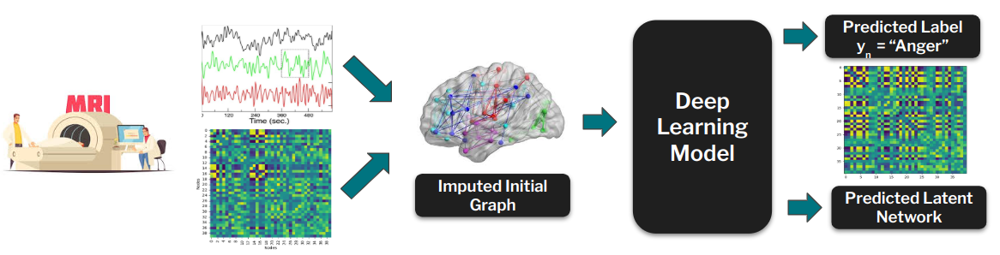
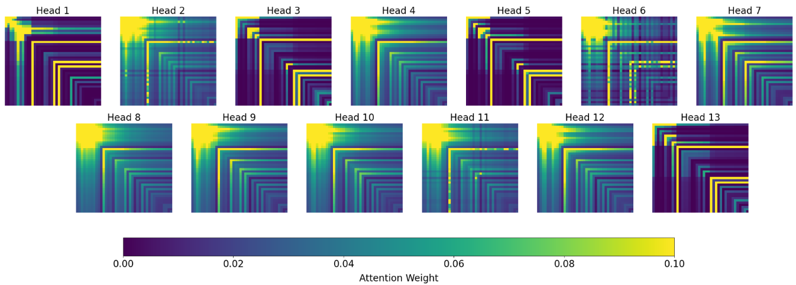

# CS-433 Machine Learning Project 2: Emotion Classification and Network Discovery: GNNs Without Predefined Graphs 

**Graph Neural Network without predefined graphs on Emo-FilM dataset**

Please refer to:
- the [latex report](GNN_E_MIP:Lab_report.pdf) for in detail explanation of the project
- the [presentation](GNN_E_MIP:Lab_presentation.pdf) given to the MIP:Lab for general overview of the project

## Table of Contents
1. [Introduction](#introduction)
2. [Getting Started](#getting-started)
3. [Data preprocessing](#data-preprocessing)
4. [Reproduce Results](#reproduce-results)
5. [Interpretation](#interpretation)

6. [Authors](#authors)


## Introduction


This project focuses on emotion classification using fMRI data collected during a movie-watching paradigm. We compare **Graph Neural Networks (GNNs)** with traditional machine learning models such as Random Forest and K-Nearest Neighbors (KNN).

 In this study, we aim **not only** to classify emotions but also to **uncover latent networks that may emerge during different emotional states.** To achieve this, we apply Graph Structure Learning (GSL) techniques, such as VIB model.


This repository provides the codebase for implementing and evaluating these methods, enabling further exploration of emotion classification from neuroimaging data.

The pipeline of our project is shown as follows: Participants watch movies inside an fMRI machine, during which BOLD signals are recorded. The recorded signals are then preprocessed, polished, and parcellated using the Schaefer atlas. Subsequently, the raw time series data is merged with an initially imputed connectivity matrix to create an initial input graph for each timepoint, corresponding to each movie for every subject. These graphs are then passed to a machine learning model. The model predicts both the target label for the current timepoint and a refined version of the initial connectivity. This refined connectivity aims to represent the learned emotional network as inferred by the model.




<!-- ## Project Structure

Here is an overview of the repository organization of the project:

```bash
.
├── README.md
├── requirements.txt
├── utils_models.py
├── run.py
├── data
│   ├── assets
│   │   ├── frmi_pipeline.png
│   │   └── Screencast from 2024-11-17 19-25-59.mp4
│   ├── processed
│   ├── raw
│   │   ├── FN_raw
│   │   ├── labels
│   │   └── movies
│   └── results
├── EDA
│   ├── 0_explore_dataset.ipynb
│   └── 1_create_dataset.ipynb
├── FNN
│   ├── FNN_model.py
│   └── FNN_train.ipynb
├── GAT
│   ├── GAT_gridsearch.py
│   ├── GAT_model.py
│   ├── GAT_train.py
│   └── plot_attention_weights.ipynb
├── GCN
│   ├── args
│   │   └── config.json
│   ├── GCN_models.py
│   └── GCN_train.py
├── KNN
│   └── KNN.ipynb
├── RF
│   └── RandomForest.ipynb
└── VIB
    ├── backbone.py
    ├── gsl.py
    ├── interpretation_VIB.ipynb
    ├── layers.py
    ├── train_eval.py
    ├── utils.py
    ├── VIB_gridsearch_outer.py
    ├── VIB.ipynb
    └── VIB_train.py

``` -->

## Getting Started

The provided code was tested with Python 3.12.5 and CUDA Version 11.6.

**Before running the project, please ensure you:**

1. **Clone this repository repository**:

```bash
git clone https://github.com/CS-433/ml-project-2-zenconvolutionalgraph.git
cd ml-project-2-zenconvolutionalgraph
```

2. **Set up a virtual enviornment**:
```
python3 -m venv myenv
source myenv/bin/activate
```

3. **Install dependencies from [requirements.txt](requirements.txt)**:
```
pip install -r requirements.txt
```

4. **Ensure to have downloaded all the necessary data**: 
The multimodal dataset Emo-filM is firstly released in the paper [**Emo-FilM: A multimodal dataset for affective neuroscience using naturalistic stimuli**](https://doi.org/10.1101/2024.02.26.582043). The Emo-FilM dataset is a highly sensitive resource, containing brain activity data that requires careful handling due to ethical and privacy concerns. In light of these considerations, the dataset has not been made publicly available in this repository. To obtain access to the Emo-FilM dataset, interested parties must apply at the [MIP:Lab](https://miplab.epfl.ch/) from EPFL. 

5. **Make sure the dataset is structured in the following way:**

```bash
data
├── assets
├── processed
│   └── all_movies_labelled_13_single_balanced.csv
├── raw
│   ├── FN_raw
│   │   ├── FN_Vis.csv
│   │   ├── ...
│   ├── labels
│   │   ├── Annot_13_AfterTheRain_stim.tsv
│   │   ├── Annot_13_..._stim.tsv
│   │   └── run_onsets.pkl
│   └── movies
│       ├── AfterTheRain_compiled414.csv
│       ├── ..._compiled414.csv
└── results
```

**ATTENTION**: If you want to execute **only** the `run.py` script (i.e., predict using the best GAT model), you can download a preprocessed version of the dataset from [here](https://drive.google.com/file/d/1cFkVn8K0uUbEPtb8Zznzm7st18MhsDxg/view?usp=drive_link). Ensure that the downloaded file is saved as `./data/processed/all_movies_labelled_13_single_balanced.csv`.


## Data preprocessing

In case the access to the data will be granted, the user **will necessitate to preprocess** the given data, as the following models will work with a refined version of the Emo-FilM dataset.

1. **Explanatory Data Analysis:**

Run the jupyter [notebook](/EDA/0_explore_dataset.ipynb) for Explanatory Data Analysis to get yourself familiar with the dataset and its relative structure.

2. **Data Preprocessing**:

Run the jupyter [notebook](./EDA/1_create_dataset.ipynb) to create a ``.csv`` file with a raw fMRI value of all the subjects of all the movies, which can be **used in all the analysis of the project**. More specifically, the data prepocessing steps are:

- Merge all the labelling dataset together.  
- Choose how to extract labels for each time point from the raw scores.      The approach followed in this study: extract a single emotion for each time point by selecting the emotion with the maximum absolute score value. (Other label extraction strategies can be found in the notebook.)
- Merge all the movie datasets together.
- Remove all useless information (e.g., name of the movie) and change the dataset to a lighter version. (e.g., ``float64`` -> ``int8``)
- Align each timepoint of each subject, each movie with the corresponding label, taking into account a delay of 4 TR for the BOLD signal to elicit.
- Balance the dataset using downsampling.
- (Optional) Dataframes containing information relative to each FN (functional network) can be generated. This step is necessary only if FNs are used in the following analysis.

**Important Notes**: Due to dataset rebalancing and the fact that the fMRI session is longer than the movie duration, some time points will **NOT** need to be predicted. This situation is encoded by assigning a **label of -1** to these points. Be careful when proceeding with the analysis. All scripts for different machine learning methods start their analysis from the CSV file obtained in this step.

**Note**: to create the preprocessed data it will take around **1h.**

## Reproduce Results

Three different modalities can be used to replicate the analysis:

1. **Baseline Models: KNN, RF, FNN** can be run easily using their respective notebooks. **GCN** can be run using the `GCN_train.py`, and the `args/config.json` can be used to set the hyperparameters of the GCN model.


2. **GSL Models: GAT and VIB** can be run with using the wrapper file ``*_gridsearch.py`` (outer script), which run a grid search (or a single run) of the inner script. This structure provides an easy wrapper for new users who want to experiment with the hyperparameters without modifying the inner logic. For each oth those model is also present:
    - ``*_model.py`` (inner script): contain the class and useful function for that model.
    - ``*_train.py`` (inner script): Runs the actual analysis and train the model (in invoked by gridsearch scirpt.)

3. **Run.py**: This script reproduces the results of our best GAT model on the training set. While KNN achieved the best overall accuracy (~9%), we decided to highlight GAT first due to its complexity and because it is the GSL method that achieved better results.

**Important**: Ensure you download all the necessary data as described in the previous section, or use only the preprocessed dataset `./data/processed/all_movies_labelled_13_single_balanced.csv`. To run the script, use:

```
python3 run.py
```

**Note**: You can run run.py without additional arguments, or customize its behavior by providing the following options:
- --dataset_path: Path to the dataset.
- --FN_dir: Path to the directory where Functional Connectivities are stored.
- --prediction_path: Path to save the final predictions.
- --model_path: Path to the trained model.

**Note**: run.py takes around **30 min** to run, as the graphs are created in-time (host lab limited us on the datastorage limit for the project).

## Interpretation
As an important part of the study is to learn the hidden representation of emotions as networks inside the brain, significant attention was given to **how to interpret the results of the GSL method**. Using the [notebook](GAT/plot_attention_weights.ipynb), it is possible to visualize the attention values and thus the latent connections built by the GAT model. Using the [notebook](VIB/interpretation_VIB.ipynb), it is possible to observe the average graph lengths for each emotion using the VIB method.


**Visualization of GAT attention heads**


## Authors

The authors of the project are: 

- Gabriele Dall'Aglio (Neuro-X)  ([@8gabri8](https://github.com/8gabri8))
- Zhuofu Zhou (Financial Engineering) ([@floydchow7](https://github.com/floydchow7))
- Cristiano Sartori (Cyber Security) ([@Eieusis](https://github.com/Eieusis))
